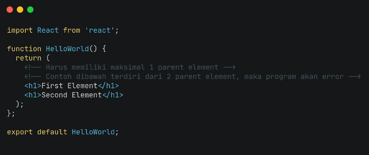
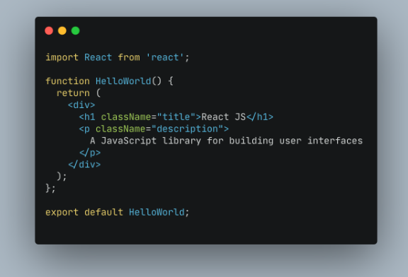
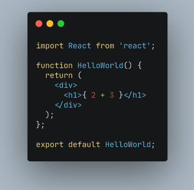

## React JS
Apa itu React JS ?

React JS adalah framework view library  Javascript untuk membuat tampilan user interface pada suatu website.

Kenapa menggunakan React JS ?
- React JS is FAST, React JS membuat aplikasi front-end menjadi lebih cepat walaupun harus menghandle berbagai data.

- React JS is Modular, kita dapat menerapkan konsep Modular javascript pada react JS. React JS membagi 1 tampilan pada website menjadi komponen-komponen kecil.

- React JS is Scalable, React JS dapat digunakan pada aplikasi berskala kecil hingga besar dan kompleks.

- React is Popular, komunitas React JS di seluruh dunia sangat besar. Kebanyakan perusahaan teknologi pun sudah menggunakan React JS.

### Mengapa terdapat tag element HTML di dalam javascript.
- Karena itu merupakan JSX. JSX adalah syntax extension for javascript. JSX dikembangkan untuk digunakan untuk pada React JS. Namun JSX perlu dicompile untuk menjadi Javascript. Dengan JSX kita dapat menggunakan HTML didalam file extension Javascript (.js)

### JSX Rules
- Setiap JSX hanya bisa memiliki 1 parent element, dan jika parent element lebih dari satu maka akan terjadi ERROR.
Dan gunakan tag element ``` <div> ``` / fragment <> sebagai parent dari element tersebut. Contoh 2 parent element:


### Class dan ClassName
- Pada JSX, attribut class di tag element HTML harus menggunakan className. Contoh :


### Curly Braces in JSX
- Kita bisa menggunakan syntax Javascript di dalam element HTML dengan curly braces.

- *element dalam tag ``` <h1> ``` akan dianggap sebagai Javascript jika menggunakan curly braces. Dan tampilan yang akan di tampilkan angka 5*.
- *dan jika tidak menggunakan curly braces akan dianggap sebagai content HTML. maka tampilan yg ditampilkan 2+3*.

## React JS Component
### Apa itu Component?
Yaitu salah satu core dari React JS. Component dibuat jika component tersebut bersifat reusable code. pada skala project maka kita harus membuat componet jika component tersebut akan dibutuhkan pada section atau page lain.
### Membuat Component
Ada 2 cara membuat component yaitu :
- Gunakan function
- Gunakan class

### State & Props
Merupakan hal yang berhubungan dengan Stateless & Stateful Component. Stateles yang berarti tidak memiliki state, dia hanya memiliki props. Sedangkan stateful berarti memiliki state dan bisa mengirim state tersebut ke component. Jadi state adalah data Local. Props digunakan agar component memiliki data yang dinamis yang dikirim dari component lain.

